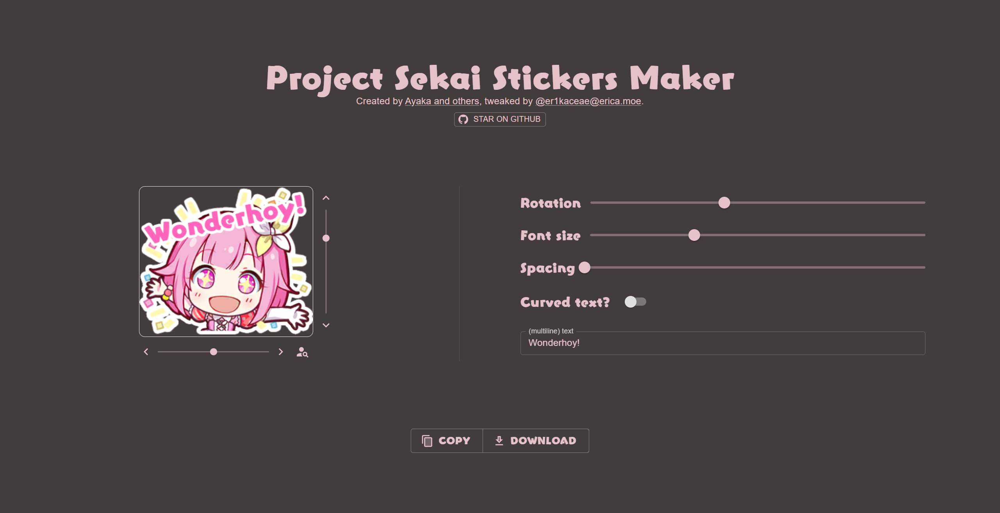

# Project Sekai Stickers

[![Contributors][contributors-shield]][contributors-url]
[![Forks][forks-shield]][forks-url]
[![Stargazers][stars-shield]][stars-url]
[![Issues][issues-shield]][issues-url]
[![MIT License][license-shield]][license-url]

  

<h2 align="center"><b>Project Sekai Stickers</b></h2>

  A responsive and modern web application to browse, copy, and download your favorite Project Sekai stickers!
   
   
  <a href="https://github.com/BedrockDigger/sekai-stickers/issues">Report Bug</a>
  ·
  <a href="https://github.com/BedrockDigger/sekai-stickers/issues">Request Feature</a>

## About

This is a forked and actively maintained version of the original Project Sekai Stickers web application. It features a modernized, responsive layout with improved UI/UX, optimized performance, and additional quality-of-life features.

##  Features

- [x] Wonderhoy!
- [x] Download/Copy stickers
- [x] Global stickers made counter
- [x] Fully responsive layout across mobile and desktop devices
- [x] Enhanced performance and accessibility
- [ ] Social share button

##  Screenshots

  

## ✨ Credits

- Original stickers from [Reddit](https://www.reddit.com/r/ProjectSekai/comments/x1h4v1/after_an_ungodly_amount_of_time_i_finally_made/)
- Cropped images by [Modder4869](https://github.com/Modder4869)
- Original Website by [TheOriginalAyaka](https://github.com/TheOriginalAyaka)
- Forked, maintained, and modernized by [BedrockDigger](https://github.com/BedrockDigger)

## 🔐 License

Distributed under the MIT License. See [`LICENSE`](https://github.com/BedrockDigger/sekai-stickers/blob/main/LICENCE) for more information.

[contributors-shield]: https://img.shields.io/github/contributors/BedrockDigger/sekai-stickers.svg?style=for-the-badge
[contributors-url]: https://github.com/BedrockDigger/sekai-stickers/graphs/contributors
[forks-shield]: https://img.shields.io/github/forks/BedrockDigger/sekai-stickers.svg?style=for-the-badge
[forks-url]: https://github.com/BedrockDigger/sekai-stickers/network/members
[stars-shield]: https://img.shields.io/github/stars/BedrockDigger/sekai-stickers.svg?style=for-the-badge
[stars-url]: https://github.com/BedrockDigger/sekai-stickers/stargazers
[issues-shield]: https://img.shields.io/github/issues/BedrockDigger/sekai-stickers.svg?style=for-the-badge
[issues-url]: https://github.com/BedrockDigger/sekai-stickers/issues
[license-shield]: https://img.shields.io/github/license/BedrockDigger/sekai-stickers.svg?style=for-the-badge
[license-url]: https://github.com/BedrockDigger/sekai-stickers/blob/main/LICENCE
